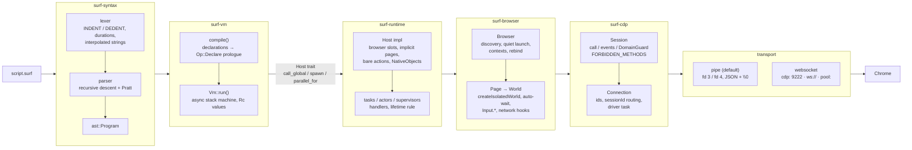
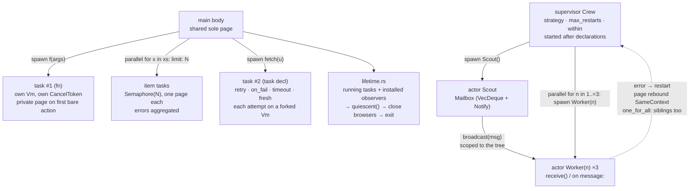
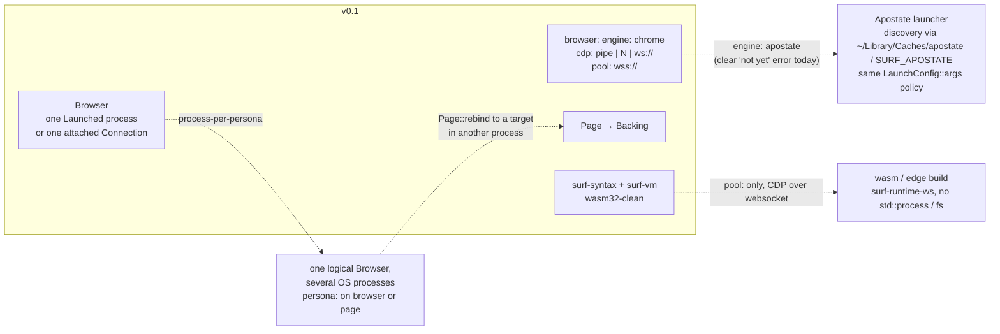

# Architecture

Surf is a scripting language plus a Rust runtime that drives Chromium over
raw CDP without producing page-observable side effects. This document is the
map; `docs/language.md` is the language spec; `DECISIONS.md` records why.

## Crate map

```
crates/
  surf-syntax    lexer (INDENT/DEDENT) → parser (recursive descent + Pratt) → AST, ariadne diagnostics   [wasm32-clean]
  surf-vm        AST → bytecode; single-threaded async stack VM; Value; Host trait; stdlib             [wasm32-clean]
  surf-cdp       Transport (pipe | websocket), \0 framing, Connection (id/session mux), Session, Event, typed Command codegen   [Send + Sync]
  surf-browser   Chrome discovery, quiet launch (exact flag list, crash watcher, shutdown ladder), Xvfb (display.rs), Browser, Page (rebindable backing), isolated World, selectors, auto-wait actions, input, network hooks, cookies, MutationObserver
  surf-runtime   implements surf_vm::Host: lazy browser slots, implicit page resolution, bare actions, NativeObject wrappers, handlers (`element_appears`, `navigation`, `message`), tasks (`spawn`, `parallel for`, `task` props), actors + mailboxes, supervisors, `shift_proxy`, lifetime rule
  surf-cli       `surf run | check | doctor | repl | install` — tokio current_thread + LocalSet, exit codes, diagnostics rendering
  surf-testserver in-process axum fixture server (+ `fixtures/*.html`) shared by surf-browser's tests and the e2e suite; dev-dependency only
protocol/        vendored browser_protocol.json + js_protocol.json (+ VERSION) for codegen
docs/            this file, language.md, quiet-cdp.md (flags, domains, detector results, perf numbers), comparison.md (measured against Playwright / Puppeteer / chromedp / chromiumoxide)
.github/         ci.yml (fmt, clippy, wasm32, test + e2e on Linux/macOS, perf reported); release.yml (generated by `dist generate` from dist-workspace.toml: tag `v*` → archives + shell/powershell installers)
examples/        hello, login, two-tabs, scrape-emit, parallel-pool, supervised
tests/e2e/       main.rs (the runner; declared as surf-cli's `e2e` test target) + `scripts/<name>.surf` + `<name>.out` (+ optional `.err`, `.code`), run through the built `surf` binary
tests/perf.rs    performance gates on the built binary (surf-cli's `perf` test target; budgets assert in `--release`)
tests/vm/        noop.surf for the cold-start gate
tools/detector/  index.html — the local detector page (served at `/detector`, embedded in `surf doctor --detector`); control.py — a deliberately noisy client that must make it FAIL
tools/           live-detectors.surf (public detector run → tools/out/, gitignored)
```

Dependency direction (strict, no cycles):

```
surf-cli → surf-runtime → surf-browser → surf-cdp
             ↓                 
           surf-vm → surf-syntax
```

`surf-syntax` and `surf-vm` have **no** dependency on `tokio`,
`std::process` or `std::fs` and build for `wasm32-unknown-unknown`
(Decision 8). `surf-vm` uses `futures::future::LocalBoxFuture` only.

## Data flow



In one line: `script.surf → surf-syntax → surf-vm → surf-runtime →
surf-browser → surf-cdp → transport → Chrome`. Everything to the left of
`surf-runtime` is IO-free; everything to the right knows nothing about
scripts.

1. **surf-cli** reads the file, builds a `tokio` `current_thread` runtime and
   a `LocalSet`, and calls `surf_runtime::run_source`.
2. **surf-syntax** lexes (spaces-only indentation → `INDENT`/`DEDENT`,
   duration literals, interpolated strings) and parses into `ast::Program`.
   Errors are `Diagnostics` rendered with ariadne.
3. **surf-vm** compiles the AST to bytecode. Top-level declarations
   (`browser:`, `fn`, `task`, `actor`, `supervisor`, `on …:`) become
   `Op::Declare` instructions in the main chunk's prologue, so the host sees
   every declaration before the first statement executes. `Vm::run` executes;
   anything that blocks is an `async` call into the `Host`.
4. **surf-runtime** implements `Host`. It turns `browser:` props into
   `LaunchOptions` (nothing launches yet), resolves bare actions to the sole
   page (auto-launching the browser and creating the page on first use),
   wraps browser objects as `NativeObject`s, and runs handlers / spawned
   tasks / actors / supervisors on the `LocalSet` with forked `Vm`s.
   `resolve_global("page")` is synchronous, so it returns a *lazy* page
   handle that binds to a real `Page` on its first (async) method call.
5. **surf-browser** owns the quiet policy: exact launch flags, pipe
   creation, isolated worlds, auto-waiting, input synthesis, ref-counted
   domain enables. It is the only crate that knows CDP method names.
6. **surf-cdp** moves JSON frames: ids, `sessionId` routing, per-method
   broadcast event channels, typed commands for an allow-list of domains.
7. **Transport**: pipe by default (Chrome reads fd 3, writes fd 4; each
   message is UTF-8 JSON + one `\0`). WebSocket only for `cdp: 9222`,
   `cdp: "ws://…"`, `pool: "wss://…"`.

## Page / backing indirection (Decision 10)

A script's `page` value never changes identity; what it points at can.

```mermaid
flowchart LR
    subgraph script["script values (Rc, stable)"]
        PV["page / page(2) / page(\"login\")"] --> PI["Rc&lt;PageInner&gt;<br/>index, name, timeout,<br/>dialog policy, blocked URLs,<br/>handlers"]
    end
    PI -- "backing (swappable)" --> B1["Backing #1<br/>session S1 · target T1<br/>context C1 · frame F1"]
    PI -. "after rebind" .-> B2["Backing #2<br/>session S2 · target T2<br/>context C2 · frame F2"]
    B1 -- "Migration {cookies, storage, url}<br/>Storage.getCookies → setCookies<br/>isolated-world localStorage dump" --> B2
    B2 --> W["fresh isolated World<br/>observers re-installed"]
```

`Page::rebind(new_backing, migration)` is the only primitive. It is driven
by three callers today and reserved for a fourth:

| caller | `RebindTarget` | keeps |
|--------|----------------|-------|
| `task` with `fresh: true` between attempts | `FreshContext` | the page's proxy; cookies / storage gone |
| `shift_proxy()` | `Proxy(next)` | cookies (`Migration { cookies: true, .. }`) |
| supervisor restart | `SameContext` | cookies and storage; tab at `about:blank` |
| per-page persona (roadmap) | a target in another OS process | whatever the persona policy says |

## Task / actor / supervisor model



Every box is a `TaskInfo` run by `spawn_task` on the one `LocalSet`
(details under *surf-runtime concurrency* below). Nothing is a thread.

## Roadmap seams

Three extensions are designed in but not built; each has a seam in the
current code and a TASKS.md entry.



* **`engine: apostate`** (Decision 7). `BrowserConfig` already parses the
  key and raises *not yet* at first use; the launcher is one more
  `LaunchOptions::resolve` branch (discovery path + the same flag policy).
  Core crates never depend on it.
* **Per-page personas** (Decisions 7, 10). A persona is a process; a
  `Browser` that owns several `Launched` processes hands `Page::rebind` a
  `Backing` from the right one. Nothing above `surf-browser` changes.
* **`pool:` / wasm** (Decision 8). `pool:` already routes through
  `Browser::connect`; a wasm build swaps `surf-cli` + the pipe transport
  for a websocket-only runtime. `surf-syntax` and `surf-vm` are built for
  `wasm32-unknown-unknown` in CI so the seam stays open.

## Quiet rules (where enforced)

| rule | enforced in |
|------|-------------|
| never `Runtime.enable`, never `DOM.enable` | `surf_cdp::FORBIDDEN_METHODS` (refused by `Session::call_raw` in every build; no typed command is generated for them), `Session::enable_domain` rejects `Runtime`/`DOM`; `surf-browser` only creates isolated worlds |
| exact launch flags, no `--enable-automation`; the only `--disable-*` is `--disable-blink-features=AutomationControlled`, on launched browsers only (Decision 12) | `surf_browser::launch::LaunchConfig::args` (unit-tested; `tests/launch.rs` checks `navigator.webdriver === false`, no infobar, and that the switch is why) |
| only `Page.enable` by default; `Network`/`Fetch` only while a hook or proxy auth needs them | `surf_cdp::DomainGuard` ref-counting, owned by `surf_browser::network` (`NetworkHooks`, the page's block guard, the per-session `FetchHub`); `tests/pages.rs::quiet_contract_only_page_enable_is_sent` traces a full session and asserts it |
| pipe by default, no listening port unless `cdp: 9222` | `surf_browser::launch::CdpMode` → `TransportChoice` (`tests/launch.rs` runs `lsof -iTCP -sTCP:LISTEN -p <pid>`) |
| no main-world injection; helpers in the isolated world under random names | `surf_browser::world` (resolver as `__surf_<random>` on the world global; `tests/pages.rs` checks the main world cannot see it), `surf_browser::observer` |

## Public contracts

These signatures are the agreed shapes; implementers keep them. They exist
as compiling skeletons in the crates.

### surf-cdp (`Send + Sync`; `tokio::sync` internally)

```rust
pub trait Transport: Send {
    fn send(&mut self, frame: &[u8]) -> BoxFuture<'_, io::Result<()>>;
    fn recv(&mut self) -> BoxFuture<'_, io::Result<Option<Vec<u8>>>>;
}

pub struct Connection;
impl Connection {
    pub fn new(t: Box<dyn Transport>) -> Arc<Connection>;
    pub fn root(&self) -> Session;
    pub async fn attach(&self, target_id: &str) -> Result<Session, CdpError>;
    pub fn set_trace(&self, on: bool);
    pub fn is_closed(&self) -> bool;
}

pub struct Session;
impl Session {
    pub async fn call<P: Serialize, R: DeserializeOwned>(&self, method: &str, params: P) -> Result<R, CdpError>;
    pub async fn call_raw(&self, method: &str, params: serde_json::Value) -> Result<serde_json::Value, CdpError>;
    pub async fn send<C: Command>(&self, c: C) -> Result<C::Response, CdpError>;
    pub fn events(&self, method: &str) -> tokio::sync::broadcast::Receiver<Event>;
    pub async fn enable_domain(&self, domain: &str) -> Result<DomainGuard, CdpError>;
    pub fn session_id(&self) -> Option<&str>;
    pub async fn detach(&self) -> Result<(), CdpError>;
}

pub struct Event { pub method: String, pub params: serde_json::Value, pub session_id: Option<String> }

pub enum CdpError {
    Protocol { code: i64, message: String, method: String },
    Closed,
    BrowserCrashed { exit_code: Option<i32>, stderr_tail: String },
    Io(std::io::Error),
    Json(serde_json::Error),
    Timeout { method: String },
}

pub trait Command: Serialize { const METHOD: &'static str; type Response: DeserializeOwned; }
```

`Connection::root()` / `attach()` take `self: &Arc<Self>` (they hand the
session an `Arc`); call them through the `Arc` returned by `new`. Additive
helpers beyond the contract: `Connection::session(id)` (wrap a `sessionId`
learned from `Target.attachedToTarget`), `close()`, `wait_closed()`,
`mark_crashed(exit_code, stderr_tail)` (the launcher's process watcher
calls it; in-flight and later calls then fail with
`CdpError::BrowserCrashed` instead of `Closed`),
`Session::with_timeout(Option<Duration>)`, `Session::domain_refcount`,
`Event::parse::<E: ProtocolEvent>()`, `surf_cdp::event::next(&mut rx)`
(drains a receiver, logging lag).

#### Transport and session model

```
  Session (root)      Session ("S1")       Session ("S2")        ← cheap clones, Arc<Connection>
      │ call(method, params)   │ events("Page.loadEventFired")
      ▼                        ▼
  ┌──────────────────────── Connection ────────────────────────┐
  │ next_id: AtomicU64       pending: id → oneshot<RawValue>    │
  │ routes: (sessionId?, method) → broadcast::Sender<Event>(1024)│
  │ domain_counts: (sessionId?, domain) → live DomainGuards     │
  └──────────────┬──────────────────────────────▲──────────────┘
   outgoing mpsc │                              │ dispatch()
                 ▼                              │
          ┌──── driver task (one per connection) ────┐
          │ select! { outgoing.recv() → transport.send │
          │           transport.recv() → dispatch }    │   recv must be cancel-safe
          └───────────────────┬──────────────────────┘
                              ▼
                   Box<dyn Transport>   pipe (fd 3 / fd 4)  |  websocket
```

* **Ids** are connection-wide and monotonic. A response is matched by `id`
  only; the `sessionId` echoed on responses is ignored.
* **Events** are routed by `(sessionId, method)`; `None` is the root. Each
  `(session, method)` has one `broadcast` channel of capacity 1024 created
  on first `events()`; `events("*")` is a per-session catch-all. When a
  channel is full the sender logs `warn!` (a slow subscriber will see
  `Lagged(n)`); `surf_cdp::event::next` logs and skips the lag. Channels of
  a session are dropped on `Session::detach()` or when Chrome reports
  `Target.detachedFromTarget` for it, so receivers end with `Closed`.
* **Sessions**: `attach(target_id)` sends
  `Target.attachToTarget{targetId, flatten:true}`; every later command on
  that `Session` carries `"sessionId"`. `detach()` sends
  `Target.detachFromTarget{sessionId}` on the root.
* **Domains**: `enable_domain("Page")` returns a `DomainGuard`. The first
  guard per `(session, domain)` sends `Page.enable`; dropping the last
  spawns a best-effort `Page.disable` (re-checked under a lock so a guard
  taken in between cancels the disable). `Runtime` / `DOM` are refused.
* **Lifetime**: the driver holds a `Weak<Connection>`. Dropping the last
  `Session`/`Arc<Connection>` (or `close()`) ends the driver, which drops
  the transport — closing the pipe / websocket. Transport EOF or error
  marks the connection closed: pending calls fail with `CdpError::Closed`,
  every event channel closes, `wait_closed()` resolves.
* **Timeouts**: none by default; `with_timeout` yields a handle whose calls
  fail with `CdpError::Timeout{method}`. The pending slot is removed when a
  caller gives up, so a late answer is ignored.
* **Tracing**: `set_trace(true)` or `SURF_TRACE_CDP=1` logs every frame at
  `debug` under target `surf_cdp::trace`, `→` sent / `←` received,
  truncated at 4 KiB.

#### Pipe framing (`--remote-debugging-pipe`)

Two anonymous pipes. Chrome reads commands from **fd 3** and writes
responses/events to **fd 4**:

```
  parent ──pipe A──▶ child fd 3      parent write end  = PipeTransport.writer
  parent ◀──pipe B── child fd 4      parent read end   = PipeTransport.reader
```

Each message is the UTF-8 JSON text followed by exactly one `0x00` byte
(ASCIIZ framing); there is no length prefix and JSON never contains a raw
NUL, so the reader scans for `0x00`:

```
  7B 22 69 64 22 3A 31 2C 22 6D 65 74 68 6F 64 22 3A ... 7D 00 7B 22 69 64 22 3A 32 ...
  {  "  i  d  "  :  1  ,  "  m  e  t  h  o  d  "  :     }  \0 {  "  i  d  "  :  2
```

`FrameDecoder` buffers across reads, so one `read` may yield zero, one or
several frames and a frame may span many reads. `pipe::create_pair()`
returns `(PipeTransport, ChildFds)`; on unix both child fds are `CLOEXEC`
and blocking — the launcher `dup2`s them onto 3 and 4 in `pre_exec`
(`dup2` clears `CLOEXEC` on the new descriptor only) and drops `ChildFds`
after `spawn` so the parent sees EOF when Chrome exits. On Windows the two
handles are made inheritable and passed as
`--remote-debugging-io-pipes=<read>,<write>` (decimal handle values);
parent ends are `tokio::fs::File`s (anonymous pipes have no overlapped IO).
`--remote-debugging-pipe=cbor` exists and is not used (TASKS.md).

#### WebSocket (`cdp: 9222`, `cdp: "ws://…"`, `pool: "wss://…"`)

One CDP message per text frame; message/frame size limits are lifted
(screenshots). `transport::tcp::connect(host, port)` does one raw
`GET /json/version` (no HTTP client dependency; `Host` must be an IP or
`localhost` or Chrome refuses), reads `webSocketDebuggerUrl` and connects.
A peer that disappears without the closing handshake is treated as EOF.

#### Codegen (`crates/surf-cdp/build.rs`)

Runs at build time over `protocol/*.json` for the allow-list `Target, Page,
Runtime, DOM, Input, Network, Fetch, Emulation, Browser, Storage, IO,
Security` and writes `$OUT_DIR/protocol.rs`, included as
`surf_cdp::protocol::{target, page, …}`. `Domain.fooBar` →
`domain::FooBar` (`Serialize`, `impl Command { METHOD, Response }`) +
`domain::FooBarResponse` (`Deserialize`; `Empty` when nothing is returned);
events → `domain::FooBarEvent` (`impl ProtocolEvent { METHOD }`). Named
string enums become Rust enums with a `#[serde(other)] Unrecognized`
variant; inline enums are `String`; `any` / opaque objects / refs outside
the allow-list are `serde_json::Value`; self-referential structs are
`Box`ed. `Runtime.enable` and `DOM.enable` are skipped.

### surf-vm (single-threaded; wasm32-clean; `futures::future::LocalBoxFuture`)

```rust
pub enum Value {
    Nil, Bool(bool), Int(i64), Float(f64), Str(Rc<str>),
    List(Rc<RefCell<Vec<Value>>>), Map(Rc<RefCell<IndexMap<Rc<str>, Value>>>),
    Duration(std::time::Duration), Fn(Rc<Closure>), Native(Rc<dyn NativeObject>),
}

pub struct Args { pub positional: Vec<Value>, pub kwargs: IndexMap<Rc<str>, Value> }

pub trait NativeObject {
    fn type_name(&self) -> &str;
    fn call_method<'a>(&'a self, vm: &'a mut Vm, name: &str, args: Args) -> LocalBoxFuture<'a, Result<Value, RuntimeError>>;
    fn get_prop(&self, name: &str) -> Option<Value> { None }
    fn to_json(&self) -> Option<serde_json::Value> { None }
    fn as_any(&self) -> Option<&dyn Any> { None }          // downcast hook (ranges, builtin fns)
    fn iter_items(&self) -> Option<Vec<Value>> { None }    // `for x in obj:` / `len(obj)`
}
// Calling a native value (`obj(args)`) invokes `call_method(vm, "__call__", args)`.

pub trait Host {
    fn declare(&self, decl: Declaration);
    fn resolve_global(&self, name: &str) -> Option<Value>;
    fn call_global<'a>(&'a self, vm: &'a mut Vm, name: &str, args: Args) -> LocalBoxFuture<'a, Result<Value, RuntimeError>>;
    fn spawn<'a>(&'a self, vm: &'a mut Vm, name: &str, args: Args) -> LocalBoxFuture<'a, Result<Value, RuntimeError>>;
    fn spawn_method<'a>(&'a self, vm: &'a mut Vm, receiver: Value, name: &str, args: Args) -> LocalBoxFuture<'a, Result<Value, RuntimeError>> { /* default: error */ }
    fn parallel_for<'a>(&'a self, vm: &'a mut Vm, items: Value, body: Rc<Closure>, opts: Args) -> LocalBoxFuture<'a, Result<Value, RuntimeError>>;
    fn sleep<'a>(&'a self, d: Duration) -> LocalBoxFuture<'a, ()>;
    fn print(&self, s: &str);
    fn emit(&self, v: &Value);
    fn fs<'a>(&'a self, op: FsOp) -> LocalBoxFuture<'a, Result<Value, RuntimeError>>;
    fn env(&self, name: &str) -> Option<String>;
}

pub enum Prop { Const(Value), Lazy(Rc<Closure>) }   // task/actor/supervisor header props

pub enum Declaration {
    Config { name: String, alias: Option<String>, props: IndexMap<Rc<str>, Value> },
    Fn { name: String, closure: Rc<Closure> },
    Task { name: String, params: Vec<Rc<str>>, props: IndexMap<Rc<str>, Prop>, body: Rc<Closure> },
    Actor { name: String, params: Vec<Rc<str>>, props: IndexMap<Rc<str>, Prop>, body: Rc<Closure> },
    Supervisor { name: String, props: IndexMap<Rc<str>, Prop>, body: Rc<Closure> },
    Handler { event: String, args: Vec<Value>, body: Rc<Closure> },
}

pub struct RuntimeError {
    pub message: String,
    pub span: Option<surf_syntax::Span>,
    pub cdp_method: Option<String>,
    pub selector: Option<String>,
    pub cause: Option<Box<dyn std::error::Error>>,
}

impl RuntimeError {
    pub fn exit(code: i32) -> Self;        // `exit` travels as an error with an `ExitRequest` cause
    pub fn cancelled() -> Self;            // cooperative cancellation, `Cancelled` cause
    pub fn exit_code(&self) -> Option<i32>;
    pub fn is_catchable(&self) -> bool;    // false for exit / cancellation
    pub fn to_diagnostic(&self) -> surf_syntax::Diagnostic;
    pub fn to_value(&self, line: Option<u32>) -> Value;   // the `catch e:` map
}

pub struct Vm;
impl Vm {
    pub fn new(host: Rc<dyn Host>, globals: Rc<Globals>) -> Vm;
    pub fn fork(&self) -> Vm;                       // same host/globals/cancel token, fresh stack
    pub async fn run(&mut self, program: &CompiledProgram) -> Result<(), RuntimeError>;
    pub async fn call(&mut self, f: Rc<Closure>, args: Args) -> Result<Value, RuntimeError>;
    pub fn call_value<'a>(&'a mut self, callee: Value, args: Args) -> LocalBoxFuture<'a, Result<Value, RuntimeError>>;
    pub fn cancel_token(&self) -> CancelToken;
}

pub fn compile(name: &str, program: &surf_syntax::ast::Program) -> Result<CompiledProgram, CompileError>;
pub fn compile_with_source(name: &str, source: &str, program: &Program) -> Result<CompiledProgram, CompileError>; // keeps a line table for `e.line`
```

Property semantics: config props are evaluated eagerly at declaration time
(`env(...)` allowed). Task/actor/supervisor props are `Prop::Const` for
literals and bare symbols (`strategy: one_for_one`) and `Prop::Lazy` thunks
for anything that must be evaluated at use time (`on_fail: shift_proxy()`
runs once per failure, never at declaration).

#### VM design notes (task 6)

- **Stack machine, one loop.** `Op` is a small `Copy` enum; constants live
  in a per-chunk pool. Script→script calls push a frame and continue in the
  same loop (no Rust recursion). Every native call (`Host::call_global`,
  `NativeObject::call_method`, stdlib) returns a `LocalBoxFuture` the loop
  awaits in place; natives call back into script code through `Vm::call`,
  which runs a nested loop on the same stack. The boxed future is what
  breaks the async-recursion cycle.
- **Global resolution order** for a bare name `f(...)` that is not a local
  or upvalue: `Host::resolve_global(f)` (user `fn`s, `page`, `browser`,
  `self`, task/actor names) → stdlib `Globals` → `Host::call_global(f)`
  (bare browser actions). So the host can shadow a stdlib name, and
  unknown names reach the host without the VM materialising a value.
- **Keyword arguments — trailing kwargs slot.** The call convention pushes
  the callee, then the positional arguments, then one `(name, value)` pair
  per keyword argument (the name as a string constant); `Call`,
  `CallGlobal`, `CallMethod`, `Spawn` carry both counts. Keywords therefore
  always *trail* the positionals on the stack and are popped into
  `Args.kwargs` in source order. For script closures, keywords bind by
  parameter name (unknown keyword / argument given twice / missing required
  parameter are runtime errors naming the parameter); defaults are
  evaluated by the callee's prologue (`ParamDefault`) only for parameters
  the caller did not supply. Natives receive `Args` and validate keywords
  themselves (`Args::check_kwargs`).
- **Scoping.** Locals are function-scoped; a cheap pre-scan of each body
  collects every assigned name so the slot exists before the first
  assignment regardless of position. A nested function assigning a name
  that exists in an enclosing function updates it (no `nonlocal`); a name
  that exists nowhere becomes a local of the nested function. Captured
  variables are *boxed on capture*: the slot is upgraded to an
  `Rc<RefCell<Value>>` when a closure captures it, so both sides see every
  assignment. Hoisted items (`fn`, `task`, `actor`, `supervisor`, `on`,
  `browser:`) are compiled as closures of `<main>` (they can read top-level
  variables) and delivered via `Op::Declare` → `Host::declare` before the
  first statement runs.
- **try/catch** is a handler stack (`TryBegin`/`TryEnd`) scoped to the
  current `Vm::call`; on an error the VM unwinds frames/stack/iterators to
  the handler and pushes `RuntimeError::to_value` (`message`, `selector`,
  `cdp_method`, `line`). `exit(n)` and cancellation are errors with marker
  causes that no handler catches. `break`/`continue`/`return` emit the
  `TryEnd`s (and `IterEnd`) needed to leave the regions they cross.
- **Cancellation** is checked at loop back-edges (`Loop`) and before every
  native call; `CancelToken` is shared by `Vm::fork`.
- **Ranges** are a `Native` (`surf_vm::Range`, lazy; `len`, indexing and
  iteration work without materialising). `json` and `fs` are native
  objects registered in `Globals`; stdlib functions referenced as values
  (`f = len`) are `BuiltinFn` natives.
- **Cold start** (parse + compile + run of a 20-line script) is asserted
  < 20 ms in a debug build by `crates/surf-vm/tests/fixtures.rs`.

### surf-browser: discovery and launch

```rust
pub fn discovery::find_chrome(explicit: Option<&Path>) -> Result<Found { path, version: Option<String>, origin }, BrowserError>;
pub fn discovery::chrome_or_skip(test_name: &str) -> Option<PathBuf>;   // tests: prints a skip message

pub struct LaunchOptions { path, cdp: CdpMode, headless: Option<bool>, virtual_display, size, profile, proxy, proxies, flags, timeout, engine, downloads: Option<PathBuf> }  // the `browser:` block
impl LaunchOptions { pub fn resolve(&self) -> Result<LaunchConfig, BrowserError>; }        // discovery + headed/headless decision + proxy parse

pub struct LaunchConfig { path, headless: bool, size, proxy: Option<ProxySpec>, profile, flags, env, virtual_display, transport: TransportChoice { Pipe | Port(u16) }, correct_automation_controlled }
impl LaunchConfig { pub fn args(&self, user_data_dir: &Path) -> Vec<String>; }           // THE flag list

pub struct ProxySpec { scheme, host, port, credentials: Option<Credentials> }             // ProxySpec::parse("http://u:p@host:8080" | "socks5://host:1080" | "host:8080")

pub async fn launch(cfg: LaunchConfig) -> Result<Launched, BrowserError>;
pub struct Launched { connection: Arc<Connection>, process: Process, profile_dir: ProfileDir, display: Option<VirtualDisplay>, proxy_credentials: Option<Credentials>, product, path, args }
impl Launched { pub fn root(&self) -> Session; pub fn stderr_tail(&self) -> String; pub async fn close(&self); }
```

Discovery order: `browser.path` → `SURF_CHROME` (both hard errors when set
but missing) → `~/.cache/surf/chrome/**` (`surf install`) → platform
locations (macOS app bundles, `/opt/google/chrome/chrome`, `PATH` names,
Windows Program Files / LocalAppData) → Playwright / Puppeteer / Apostate
caches via a bounded walk for an executable named like a Chromium binary
(newest version first). Version via `--version` with a 3 s timeout. The
`NotFound` error lists every location tried.

Launch: a `surf-profile-*` temp dir (removed on close) or the user's
`profile:`; Xvfb on Linux when `virtual: true` and no `DISPLAY`
(`display.rs`); pipe pair from `surf_cdp::transport::pipe::create_pair`
installed on fd 3 / fd 4 in `pre_exec` (`launch::sys`, the crate's only
`unsafe`; fds already at 3/4 are moved first); stderr drained into a
64-line ring buffer; first `Browser.getVersion` within 10 s or the error
carries the stderr tail. Port mode (`cdp: N`, `0` = Chrome picks, read from
`DevToolsActivePort`) connects through `/json/version`. A watcher task owns
the `Child`; an unexpected exit calls `Connection::mark_crashed` so calls
fail with `BrowserCrashed { exit_code, stderr_tail }` (the transport
wrapper delays EOF up to 1 s so in-flight calls see the crash, not
`Closed`). `Launched::close()` (idempotent; the Ctrl-C handler calls it):
`Browser.close` → 2 s → `SIGTERM` → 2 s → `SIGKILL`, then remove the temp
profile (retrying while helper processes drain) and stop Xvfb. Dropping a
`Launched` without `close()` kills the process and removes the temp
profile best-effort.

### surf-browser: Browser, pages, worlds, actions (task 4)

```rust
pub struct Browser;                                   // one launched process or one attached connection
impl Browser {
    pub async fn launch(opts: LaunchOptions) -> Result<Rc<Browser>, BrowserError>;        // CdpMode::Attach → connect()
    pub async fn connect(ws_url: &str, opts: LaunchOptions) -> Result<Rc<Browser>, BrowserError>;   // pool: / cdp: "ws://…"
    pub async fn new_page(&self, opts: NewPageOptions { proxy, isolated, name }) -> Result<Page, BrowserError>;
    pub async fn page(&self, index: usize) -> Result<Page, BrowserError>;           // creates every missing page up to index
    pub async fn page_named(&self, name: &str) -> Result<Page, BrowserError>;       // creates + names when missing
    pub async fn sole_page(&self) -> Result<Page, BrowserError>;                    // 0 → create; 1 → it; n → Ambiguous { names }
    pub fn pages(&self) -> Vec<Page>;
    pub async fn close_page(&self, page: &Page) -> Result<(), BrowserError>;
    pub async fn create_backing(&self, context_id: Option<String>) -> Result<Backing, BrowserError>;
    pub async fn rebind_page(&self, page: &Page, proxy: Option<&str>, migration: Migration) -> Result<(), BrowserError>;
    pub async fn rebind_page_to(&self, page: &Page, target: RebindTarget, migration: Migration) -> Result<(), BrowserError>; // SameContext | FreshContext | Proxy(url)
    pub fn page_proxy(&self, page: &Page) -> Option<String>;                        // proxy of the page's private context
    pub async fn close(&self) -> Result<(), BrowserError>;                          // idempotent; attached browsers are never closed
}

pub struct Backing { pub session: Session, pub target_id: String, pub browser_context_id: Option<String>, pub frame_id: String }
pub struct Migration { pub cookies: bool, pub storage: bool, pub url: bool }      // Migration::ALL
pub enum WaitUntil { Load, DomContentLoaded, NetworkIdle, Commit }
pub enum DialogPolicy { Accept, Dismiss, AcceptWith(String) }

#[derive(Clone)] pub struct Page(Rc<PageInner>);   // stable handle; clones share state
impl Page {
    pub async fn attach(index: usize, backing: Backing, timeout: Duration, credentials: Option<Credentials>) -> Result<Page, BrowserError>;
    pub fn index(&self) -> usize;  pub fn name(&self) -> Option<String>;  pub fn label(&self) -> String;   // `1` or `"login"`
    pub fn backing(&self) -> Option<Backing>;  pub fn session(&self) -> Result<Session, BrowserError>;  pub fn is_open(&self) -> bool;
    pub fn timeout(&self) -> Duration;  pub fn set_timeout(&self, d: Duration);
    pub async fn world(&self) -> Result<World, BrowserError>;  pub fn invalidate_world(&self);
    pub async fn with_world<T>(&self, f: impl Fn(World) -> Fut) -> Result<T, BrowserError>;   // retries once on a destroyed context
    pub async fn eval(&self, expression: &str) -> Result<serde_json::Value, BrowserError>;
    pub async fn eval_fn(&self, function_source: &str, args: Vec<Value>) -> Result<Value, BrowserError>;
    pub async fn goto(&self, url: &str, wait_until: WaitUntil) -> Result<(), BrowserError>;
    pub async fn wait_for_navigation(&self, wait_until: WaitUntil) -> Result<(), BrowserError>;
    pub async fn reload(&self, w: WaitUntil); pub async fn back(&self, w: WaitUntil) -> Result<bool, _>; pub async fn forward(&self, w: WaitUntil) -> Result<bool, _>;
    pub async fn url(&self) -> Result<String, _>;  pub async fn title(&self) -> Result<String, _>;
    pub fn on_dialog(&self, policy: DialogPolicy);  pub fn dialogs(&self) -> Vec<Dialog>;
    pub async fn screenshot(&self, path: &Path, full_page: bool);  pub async fn screenshot_png(&self, full_page: bool) -> Result<Vec<u8>, _>;
    pub async fn pdf(&self, path: &Path);  pub async fn pdf_bytes(&self) -> Result<Vec<u8>, _>;
    pub async fn set_viewport(&self, w: u32, h: u32);
    pub async fn cookies(&self) -> Result<Vec<Cookie>, _>;  pub async fn set_cookies(&self, &[Cookie]);  pub async fn clear_cookies(&self);
    pub async fn local_storage(&self) -> Result<Map, _>;  pub async fn set_local_storage(&self, Map);  pub async fn clear_local_storage(&self);
    pub async fn network_hooks(&self) -> Result<NetworkHooks, _>;            // Network held while the handle lives
    pub async fn intercept(&self, patterns: Vec<UrlPattern>) -> Result<Interception, _>;   // Fetch via the page's FetchHub
    pub async fn set_blocked_urls(&self, patterns: Vec<String>);  pub fn blocked_urls(&self) -> Vec<String>;
    pub async fn answer_dialog(&self, accept: bool, prompt_text: Option<String>);        // DialogPolicy::Defer
    pub(crate) fn mark_action(&self);                                        // arms wait_for_navigation (see Navigation)
    pub async fn rebind(&self, new_backing: Backing, migration: Migration) -> Result<(), BrowserError>;
    pub async fn close(&self) -> Result<(), BrowserError>;
    // actions.rs — every one takes `ActionOptions { timeout, delay }`
    pub async fn click / dblclick / right_click / hover / focus / scroll_into_view(&self, selector: &str, opts);
    pub async fn type_text / fill(&self, selector: &str, text: &str, opts);
    pub async fn press(&self, key: &str);  pub async fn press_on(&self, selector: &str, key: &str, opts);
    pub async fn check / uncheck(&self, selector, opts);  pub async fn select(&self, selector, values: &[&str], opts) -> Result<Vec<String>, _>;
    pub async fn scroll_by / scroll_to(&self, x: f64, y: f64);
    pub async fn text / html / value(&self, selector, opts) -> Result<String, _>;  pub async fn attr(&self, selector, name, opts) -> Result<Option<String>, _>;
    pub async fn exists(&self, selector) -> Result<bool, _>;  pub async fn count(&self, selector) -> Result<usize, _>;   // no wait
    pub async fn all(&self, selector) -> Result<Vec<Element>, _>;  pub async fn first(&self, selector) -> Result<Option<Element>, _>;
    pub async fn wait(&self, selector, opts) -> Result<Element, _>;  pub async fn wait_gone / wait_text / wait_url(…);  pub async fn wait_for(&self, d: Duration);
}

pub struct Element;   // an objectId in the page's isolated world; same actions/readers without re-resolving; `all(sel)` scoped; released on drop

pub struct World { pub session: Session, pub context_id: i64, pub name: String, pub frame_id: String, pub resolver: String }
impl World {
    pub async fn create(session: Session, frame_id: &str) -> Result<World, BrowserError>;     // Page.createIsolatedWorld + resolver install
    pub async fn eval(&self, expression: &str) -> Result<Value, _>;                            // Runtime.evaluate{contextId}
    pub async fn call(&self, function_declaration: &str, args: Vec<Value>) -> Result<Value, _>; // Runtime.callFunctionOn{executionContextId}
    pub async fn call_handle(…) -> Result<RemoteObject, _>;  pub async fn call_on(&self, object_id, decl, args) -> Result<Value, _>;
    pub async fn resolve(&self, sel: &Selector, all: bool) -> Result<Vec<String /* objectId */>, _>;
    pub async fn add_binding(&self, name: &str) -> Result<(), _>;                              // Runtime.addBinding{executionContextId}
    pub async fn release(&self, object_id: &str);  pub async fn release_all(&self);
}

pub enum Selector { Css(String), Text(String), XPath(String) }   // Selector::parse("#a" | "text=Buy now" | "xpath=//a" | "//a")
pub enum BrowserError { …, Timeout { action, selector, waited_ms, last_state }, Script { text, line }, Ambiguous { names }, PageClosed { index }, … }
```

**Pages and contexts.** A page is `Target.createTarget{url: "about:blank"}`
→ `Target.attachToTarget{flatten: true}` → `Page.enable` (ref-counted
`DomainGuard`, the only domain enabled by default) +
`Page.setLifecycleEventsEnabled{enabled: true}` → one `tokio::spawn`ed
event task per page. Pages share the default browser context (cookies
like tabs) unless `NewPageOptions { proxy }` or `{ isolated: true }` asks
for `Target.createBrowserContext{proxyServer, disposeOnDetach: true}`;
the context is disposed by `close_page`. Names map to the index of the
page created for them; errors list pages as `1, 2, "login"`.

**Navigation.** `goto` subscribes to `Page.lifecycleEvent`, sends
`Page.navigate`, fails fast on `errorText` (`BrowserError::Navigation`),
and waits for the event with the response's `loaderId` and the requested
name (`load` by default, `DOMContentLoaded`, `networkIdle`); a missing
`loaderId` is a same-document navigation and returns at once.
`wait_for_navigation` / `reload` / `back` / `forward` wait for the next
main-frame `Page.frameNavigated` (a `BackForwardCacheRestore` finishes
immediately) and then the lifecycle event for that frame's `loaderId`.
Because broadcast receivers buffer from the moment they are created,
every action that can navigate (`click`, `press`, …) first calls
`Page::mark_action`, which subscribes to `Page.frameNavigated` /
`Page.lifecycleEvent` and records the navigation epoch; a
`wait_for_navigation` that follows takes those armed receivers, so a
navigation that committed between the action and the wait is still seen
(`commit` returns at once when the epoch already advanced). The armed
state is consumed by the wait, replaced by the next action and dropped on
rebind / close. `url()` reads `location.href` in the isolated world.

**Worlds.** `page.world()` lazily runs `Page.createIsolatedWorld{frameId,
worldName: <random 12 chars>, grantUniveralAccess: true}` and installs
the selector resolver on the world's global object as
`__surf_<random 12 chars>` — only that world can see it (tested by
injecting a main-world `<script>` that looks for the name). The page's
event task bumps a navigation epoch on every main-frame
`Page.frameNavigated`, so the next `world()` creates a fresh world; a
navigation the task has not yet seen surfaces as a `Cannot find context` /
`Execution context was destroyed` protocol error, which `with_world`
answers by re-creating the world and retrying once. All handles live in
object group `surf`.

**Dialogs.** `Page.javascriptDialogOpening` is answered by the event task
per `DialogPolicy` (`Accept` by default — a prompt returns its default
text; `Dismiss`; `AcceptWith(text)`); every dialog is recorded for
`page.dialogs()`. Because the task runs concurrently, an action whose
handler opens `alert()` still returns.

**Auto-wait.** Every action polls every 50 ms up to the timeout: resolve
(`World::resolve`) → a readiness check with `this` = element (attached →
visible: non-empty box and not `visibility: hidden` → stable: same box
over two animation frames, 50 ms fallback for throttled tabs → enabled:
not `:disabled` / `aria-disabled`) → `DOM.scrollIntoViewIfNeeded{objectId}`
→ `DOM.getContentQuads{objectId}` → centre of the first quad → an
`elementFromPoint` hit test (an overlay makes it retry) →
`Input.dispatchMouseEvent` `mouseMoved` / `mousePressed` / `mouseReleased`.
Timeouts carry `action`, `selector`, `waited_ms` and the last observed
state (`not found`, `hidden`, `moving`, `disabled`, `covered by <div#x>`).
Readers wait for attachment only; `exists` / `count` never wait. `type`
dispatches `keyDown`(with `text`)/`keyUp` per US-layout character and
`Input.insertText` for anything else, with optional jittered `delay`;
`fill` selects all and `insertText`s (empty text → `Delete`); `press`
parses `Shift+Tab` / `Ctrl+a` / `Mod+Enter` into `key`, `code`,
`windowsVirtualKeyCode`, modifiers (and `commands: ["SelectAll"]` etc. for
`Meta` shortcuts on macOS). `text=` selectors match the trimmed
`textContent` of the deepest element, exact (case-insensitive) before
substring, skipping `script`/`style`.

**Network (`network.rs`, task 9).** Nothing is on by default; `Network`
and `Fetch` are ref-counted `DomainGuard`s owned by whoever needs them:

| need | domain | owner |
|------|--------|-------|
| `on request` / `on response` | `Network` | `NetworkHooks` (subscribes to `requestWillBeSent`, `responseReceived`, `loadingFinished`, `loadingFailed` *before* `Network.enable`; split into a `NetworkHold` + `HookStreams` so the runtime's observer can keep the domain while handing out `ResponseObject`s whose `body()` waits for `loadingFinished` then `Network.getResponseBody`) |
| `block([...])` | `Network` | the page, while the list is non-empty (`Network.setBlockedURLs` with Chrome's unanchored `*` patterns; re-applied on rebind) |
| `intercept(pattern):` | `Fetch` | `Interception` (an `mpsc` of `InterceptedRequest`s with `continue_request(overrides)` / `fulfil(status, headers, body)` / `fail(reason)` and a decided flag) |
| proxy credentials | `Fetch` (`handleAuthRequests`) | the page, until the first challenge is answered |

`Fetch` has exactly one owner per page session, the `FetchHub`: proxy
authentication and interception both register their need with it and it
re-sends `Fetch.enable{handleAuthRequests, patterns}` whenever either
changes (so a hook can no longer switch auth handling off by sending its
own `enable`, the TASKS item from step 4). The hub answers
`Fetch.authRequired{source: "Proxy"}` with the context's credentials
(`Default` otherwise, so a site's own 401 reaches the page), forwards a
`Fetch.requestPaused` whose URL matches an interceptor pattern to the
interceptor and continues everything else untouched. Chrome caches proxy
credentials per context, so after the first answered challenge the auth
need is dropped and `Fetch` goes away unless an interceptor holds it.
Credentials never reach the command line (`--proxy-server` carries only
`scheme://host:port`); `Browser::new_page(NewPageOptions { proxy })`
creates a context with its own `proxyServer` and installs the same hub.

**Downloads.** `downloads: dir` sends `Browser.setDownloadBehavior{
behavior: "allowAndName", downloadPath, eventsEnabled: true}` for the
default context (and every private one as it is created) and runs one
`DownloadTracker` on the root session that follows
`Browser.downloadWillBegin` / `downloadProgress`, renames the finished
`<guid>` file to its `suggestedFilename` (de-duplicated) and serves
`Browser::wait_download(page, timeout)` — the next completed download
whose `frameId` belongs to that page.

**Storage.** `local_storage()` / `set_local_storage` / `clear_local_storage`
are isolated-world evals on the current origin (no `DOMStorage` domain).

**Dialogs.** `DialogPolicy::Defer` leaves a dialog open for the runtime's
`on dialog` handler, which answers through `Page::answer_dialog`
(`Page.handleJavaScriptDialog`); the event task still records it in
`dialogs()`.

**Rebind (Decision 10).** `Page::rebind(new_backing, migration)` exports
cookies (`Storage.getCookies{browserContextId}` on the root session) and
`localStorage`/`sessionStorage` (isolated-world eval), tears down the old
backing (event task, `Page` guard, `FetchHub`, block guard), installs the new one,
imports cookies (`Storage.setCookies`), re-navigates to the URL and
restores storage (origin-bound, so only together with the URL), then
detaches and closes the old target. The handle, index and name are
unchanged. `Browser::rebind_page_to(page, target, migration)` creates the
target per `RebindTarget` — `SameContext` (new tab, same cookies /
storage), `FreshContext` (a new empty context that keeps the page's proxy,
if any), `Proxy(url)` (a new context behind that proxy, credentials
re-installed) — and disposes the old private context; `rebind_page(page,
proxy, migration)` is the old two-case wrapper. The browser remembers the
proxy of every private context (`page_proxy`). Page indices never shift:
`page(n)` for a closed index is `PageClosed`, not a new page. One
mechanism serves `fresh: true` retries, `shift_proxy()`, supervisor
restarts, and later per-page Apostate personas (one process per persona;
a logical `Browser` may own several OS processes).

**Measured quiet contract.** `crates/surf-browser/tests/pages.rs::quiet_contract_only_page_enable_is_sent`
traces every frame of a full session (navigate, type, click, hover,
select, readers, `all`, screenshot, cookies, viewport, waits, back) and
asserts the only `*.enable` sent is `Page.enable` — no `Runtime.enable`,
`DOM.enable`, `DOM.getDocument`, `Network.enable` or `Fetch.enable` — and
`binding_called_fires_without_runtime_enable` verifies Decision 9's
channel.

### surf-runtime (task 7)

```rust
pub struct RuntimeOptions { trace_cdp, chrome_path, headless: Option<bool>, json, timeout: Option<Duration>, color }
pub struct Runtime;                       // Rc; one per `surf run` / REPL session; implements surf_vm::Host
impl Runtime {
    pub fn new(opts) -> Rc<Runtime>;
    pub async fn run(self: &Rc<Self>, name, source) -> Result<i32, RunError>;          // compile → main body → lifetime rule → shutdown → exit code
    pub async fn exec(self: &Rc<Self>, name, source) -> Result<Option<i32>, RunError>; // one REPL chunk; nothing waited for or closed
    pub async fn shutdown(&self);          // close every launched browser (15 s cap each)
    pub fn render_error(&self, &RuntimeError) -> String;   // ariadne, with the script line / selector / CDP method
}
pub async fn run_source(name, source, opts) -> Result<i32, RunError>;   // Runtime::new(opts).run(…)
pub fn is_no_browser(&RuntimeError) -> bool;   // discovery failed / bad `browser.path` → CLI exit 3
```

**Browser slots** (`browsers.rs`). Every `browser:` / `browser name:` block
becomes a [`BrowserSlot`] (`"default"` for the unnamed block) holding a
`BrowserConfig` (`config.rs`: props → `LaunchOptions`; values that do not
type-check and `engine: apostate` are recorded and raised at first use,
never at declaration). Nothing launches until an action needs a page;
`BrowserSlot::get` serialises concurrent first uses behind a
`tokio::sync::Mutex`, applies the CLI overrides (`--chrome`,
`--headless` / `--headed`, `--timeout` win over the script), prints the
one-line "running headless" notice when `headless:` is unset and no
display exists, then `Browser::launch` (or `Browser::connect` for
`pool:`; `cdp: "ws://…"` goes through `launch` as `CdpMode::Attach`).

**Implicit resolution** (`pages.rs`). A bare action asks `Runtime::sole_page(action)`:
the task context (a `tokio::task_local!` `TaskCtx`) wins when it has a
page bound — a handler body is bound to the page its event fired on, a
spawned task / actor / `parallel for` item gets a **private page** on its
first bare action (named `<task>#<id>`, `isolated: true` when the task is
`fresh`, closed when the task ends, recorded in `Runtime::private_pages`)
— otherwise the default browser's *shared* sole page: the open pages that
are not some task's private page (0 → create; 1 → it; several → `several
pages are open (1, 2, "login") — say which: page(2).click(…)`). The default
browser is the unnamed block, the implicit one when nothing is declared, or
the only named one; two named browsers and no unnamed block is `several
browsers are declared ("work", "home") — say which: work.goto(…)`.

**Name resolution.** `Host::resolve_global` answers user `fn`s, `page`
(a lazy `PageObject` that binds on its first method call — so
`page.goto(…)` and `page(2)` both work without an async lookup), `browser`
and named browsers (`BrowserObject`), and every bare action as a callable
`BareAction` — they therefore shadow stdlib names of the same spelling
(`type`); `type(v)` with one argument falls back to the stdlib function.
`self` (a `SelfObject` for the current task) and declared supervisors
(`SupervisorObject`). `Host::call_global` handles what is left: a declared
`task` called synchronously (`tasks::call_decl`), `shift_proxy`, `send` /
`broadcast` / `receive` / `wait_for_message`; anything else is `undefined
function` with a suggestion.
All page methods live in one dispatcher (`methods.rs::page_method`) shared
by bare actions, `page.…`, `page(n).…` and `browser.…`; elements
(`all`, `first`, `wait`, the `event` of `on element_appears`) use
`element_method`. `BrowserError` → `RuntimeError` conversion (`errors.rs`)
fills `selector` / `cdp_method` and keeps the original error as the cause.
`eval(fn(): …)` slices the lambda's source text by its span (the runtime
keeps the script text) and sends it verbatim; a block lambda becomes an
IIFE.

**`on element_appears`** (`handlers.rs`, Decision 9). Each page the runtime
hands out gets one observer task when at least one such handler is
declared (`Runtime::instrument` runs after every page creation):
`page.world()` → `Runtime.addBinding{name: __surf_on_<random>,
executionContextId}` → a `MutationObserver` installed under random names
that resolves every handler's selector through the world's resolver and
calls the binding once per newly matching element (handles are kept in an
isolated-world array so the handler receives the element) → listen for
`Runtime.bindingCalled` and main-frame `Page.frameNavigated` (re-install in
the fresh world; up to four attempts while the context settles). Each
firing runs the body on a `spawn_local` task with a forked VM. Measured:
`Runtime.bindingCalled` arrives without `Runtime.enable` through the whole
stack (e2e `handler` script); no polling fallback was needed.

The same observer task serves `on navigation(pattern)`: every main-frame
`Page.frameNavigated` whose URL matches dispatches the body with `event =
{url, page}`. A `frameNavigated` that arrives after the observer was
installed in the already-committed document is recognised (the installed
world still answers) and does not install a second observer. After a
`Page::rebind` the old session's channels close (the old observer task
ends) and `Runtime::after_rebind` installs a new one on the new session.

**Additive surf-browser change (task 7):** `Element::from_handle(page, world,
object_id, label)` — wrap a handle the runtime already holds.

### surf-runtime concurrency (task 8)

```rust
pub struct TaskInfo { id, name, flavor: Fn|Task|Actor|Item, ctx: Rc<TaskCtx>, mailbox: Mailbox, message_handlers, group: Option<u64>, supervised, keep_page, … }
pub fn spawn_task(rt, callee: Callee, args, name, flavor, page: Option<(Rc<Browser>, Page)>, supervising: Option<Rc<SupervisorRun>>) -> Rc<TaskInfo>;
pub async fn run_decl(rt, decl: &Rc<TaskDecl>, args, vm) -> Result<Value, RuntimeError>;   // retry / on_fail / timeout / fresh
pub struct SupervisorRun { id, name, strategy, max_restarts, within, children, restarts, … }  // starts from Host::declare
task_local! { TASK_CTX: Rc<TaskCtx>; CURRENT_TASK: Rc<TaskInfo>; SUPERVISING: Rc<SupervisorRun> }
```

**Tasks** (`tasks.rs`). Every concurrent unit — `spawn f()`, `spawn
task()`, `spawn Actor()`, each `parallel for` item — is a `TaskInfo` in
`Runtime::tasks` run by `spawn_task` on its own `spawn_local` task with a
**fresh `Vm`** (own `CancelToken`, shared `Globals`). The body is raced
against the task's cancellation (`h.cancel()`, `fail_fast`, `one_for_all`)
and the program's `exit_signal`; afterwards the private page is closed
(unless a supervisor keeps it for a restart), the result is stored for
`join()`, and an unjoined failure is rendered on stderr (exit code 1). A
`task` / `actor` body goes through `run_decl` whether spawned or called:
properties are resolved once (`Prop::resolve`; `on_fail` stays lazy), then
up to `retry + 1` attempts each on a forked VM (so a `timeout:` can drop an
attempt mid-await without corrupting the task's VM); between attempts
`fresh` moves the current page to a `RebindTarget::FreshContext`, then
`on_fail` runs. `shift_proxy()` is `Runtime::rebind(…,
RebindTarget::Proxy(next), Migration { cookies: true, .. })` with a
round-robin cursor on the `BrowserSlot`. `parallel for` spawns one `Item`
task per element; `limit:` is a `tokio::sync::Semaphore` acquired inside
the item before the body runs (so at most `limit` pages exist); the parent
waits on all (`select_all` with `fail_fast`), aggregates failures into one
error listing each item, and a drop guard cancels the items if the parent
itself is cancelled.

**Actors** (`actors.rs`). Every task owns a `Mailbox` (`VecDeque` +
`Notify`). `send` / `broadcast` deep-copy the value per recipient and
`deliver` it: into the mailbox, or straight to `on message:` handler tasks
when the actor registered any (`Host::declare` sees the handler from inside
the actor's task via `CURRENT_TASK`; queued messages are drained to it).
`broadcast` is scoped to the sender's supervisor tree (`TaskInfo::group`)
or the whole program. An actor with handlers stays alive after its body
until cancelled.

**Supervisors** (`supervisors.rs`). `Host::declare` creates a
`SupervisorRun` and starts it at once (it first runs when the main body
yields, i.e. after every declaration is in). The body runs under
`SUPERVISING`; `tasks::spawn` registers the new task as a child
(`parallel for` items of the body inherit the scope). The loop waits for
any child (`select_all` on `TaskInfo::wait`), drops children that end
normally or cancelled, and on an error prunes the restart window, gives up
when `restarts >= max_restarts` (cancels every child, stores the error for
`join()`), otherwise restarts per strategy: the failed child's page is
rebound `SameContext` (new tab, cookies / storage intact) and handed to
the new task through `TaskCtx::spawned_with`; `one_for_all` cancels and
waits for the siblings first.

**Measured (debug build, this Mac):** 50 concurrent pages (`parallel for`
without a limit, each page loading a 100 ms fixture) complete in 3.1 s end
to end including launch and shutdown
(`tests/e2e/main.rs::fifty_concurrent_pages_under_thirty_seconds`);
the e2e scripts `parallel-pool`, `supervised`, `scout-workers`,
`shift-proxy`, `handler-rebind`, `spawn-join`, `concurrency-basics`,
`supervisor-giveup`, `one-for-all` each run in ≈ 1 s.

### Lifetime rule

A program stays alive while any handler block is registered or any task is
running. When the main body returns and nothing is pending, browsers Surf
launched are closed (temp profiles deleted, `profile:` dirs kept) and the
process exits 0. `exit` / `exit(n)` cancels the main body's VM via
`CancelToken`, drops every spawned task at its `exit_signal` race, closes
everything, and exits with `n`. Attached browsers (`cdp: "ws://…"`,
`pool:`) are never closed.

Implementation (`lifetime.rs`): counters for running tasks and installed
observers plus a `Notify`; `Runtime::finish` awaits `quiescent()` after the
main body. "Registered" means *installed on a page*: a script that declares
`on element_appears` but never touches a browser still exits (nothing could
ever fire). The main body runs under `tokio::select!` against
`exit_signal()`, so `exit` from a handler or Ctrl-C (`tokio::signal::ctrl_c`
→ exit 130) drops it mid-await — a `goto` waiting on a slow page does not
delay shutdown. A handler body that errors is rendered on stderr, the
program continues, and the final exit code is 1.

### surf-cli

`surf run <file> [--json] [--trace-cdp] [--timeout 30s] [--headless|--headed]
[--chrome <path>]`; `surf <file.surf>` is rewritten to `surf run …` before
clap sees it (so `#!/usr/bin/env surf` works — the lexer treats the shebang
as a comment). `--json` makes `print` write `{"print": "…"}` lines;
`--trace-cdp` sets `SURF_TRACE_CDP=1` before launch and `set_trace(true)`
after. Runtime errors are rendered by `Runtime::render_error` (ariadne:
message, script line, `selector:` label, `CDP method:` note; a crash
message includes the browser's stderr tail). Exit codes: 0, 1 runtime, 2
syntax, 3 no browser (discovery failed or `browser.path` / `SURF_CHROME`
is not a binary), 130 interrupted, or `exit(n)`.

`--trace-cdp` also switches the default log filter to
`warn,surf_cdp::trace=debug` (RUST_LOG still wins) and the first traced
frame logs `first CDP frame sent N ms after start`, measured from
`surf_cdp::connection::mark_process_start()` at the top of `main`.

`surf doctor`: discovery (path, origin, `--version`), display detection,
Xvfb presence on Linux, a timed headless pipe launch (`surf_browser::launch`
→ the `transport:` line is spawn → first `Browser.getVersion` answered →
a second round trip → the exact flag list → the shutdown ladder timing).
`surf doctor --detector` then launches a browser the way a script would
(headed when a display exists), writes the embedded `tools/detector/index.html`
to a temp file, loads it, types / hovers / clicks, and prints every
`<li data-check>` row (exit 1 on a `FAIL`). `surf repl`: one chunk per line (a line ending in `:` opens
a block closed by an empty line) on one `Runtime` via `Runtime::exec`, so
the browser, pages, `fn`s and handlers persist; top-level variables do not
(TASKS.md). `surf install`: reads Chrome for Testing's
`last-known-good-versions-with-downloads.json`, downloads the stable build
for this platform with the system `curl`, unpacks with `unzip` (`tar` on
Windows) into `~/.cache/surf/chrome/<version>/`, and verifies with
`--version`; discovery picks it up from there.

## Threading model

`tokio` `current_thread` + `LocalSet`. VM values are `Rc`; `surf-browser`
and `surf-runtime` are `!Send`. `surf-cdp` is `Send + Sync` so that a
thread-per-core build can later shard connections across threads
(Decision 5). Thousands of concurrent CDP calls on one thread are fine —
scripts are IO-bound.

## Testing

- Unit tests per crate (`cargo test --workspace`).
- `tests/e2e/main.rs` (`cargo test -p surf-cli --test e2e`) runs against a
  real Chrome: `SURF_CHROME` overrides discovery; when no Chrome is found
  the test prints a skip message and passes. It must actually run on
  developer Macs and in the CI `e2e` job (`xvfb-run` on Linux, native on
  macOS). `scripts_match_expected_output` runs every
  `tests/e2e/scripts/<name>.surf` through the built `surf` binary
  (`--headless --timeout 15s`; env: `SURF_E2E_BASE` fixture URL,
  `SURF_E2E_PROXIED_BASE` the same server as `http://surf.test:<port>`
  (non-loopback, so Chrome proxies it), `SURF_E2E_PROXY_A/B` two tagging
  forward-proxy stubs, `SURF_E2E_PROXY_AUTH` an authenticating one
  (`user:pass@`), `SURF_E2E_TMP` a per-script scratch dir) and compares
  normalised stdout with `<name>.out`, stderr with `<name>.err` when
  present, and the exit code with `<name>.code` (default 0); a mismatch
  prints a unified diff. `SURF_E2E_FILTER=<substring>` runs a subset,
  `SURF_E2E_UPDATE=1` rewrites the expectations (review the diff),
  `SURF_E2E_HEADED=1` runs headed; a script named `*-headed.surf` always
  runs `--headed` and is skipped without a display. 35 scripts today: hello,
  login, two-tabs, implicit-page, ambiguity, ambiguity-error, timeout-error,
  handler, handler-rebind, eval, eval-args, screenshot, forms, waits,
  navigation, dialogs, dialog-policy, hooks, intercept, block, cookies,
  local-storage, download, proxy-auth-browser, proxy-auth-page,
  shift-proxy, spawn-join, concurrency-basics, parallel-pool, supervised,
  scout-workers, supervisor-giveup, one-for-all, detector, detector-headed.
  Other tests cover `--json`, a rendered runtime error, the shebang
  shorthand + `exit(n)`, `surf check`, `surf doctor`, the REPL, the 50-page
  timing gate and the port-exposure gate (`lsof -iTCP -sTCP:LISTEN` on the
  browser and `surf` pids while a script holds a browser open over the pipe).
- `tests/perf.rs` (`cargo test --release --test perf`): cold start of
  `tests/vm/noop.surf` (median of 20 < 10 ms), idle RSS with one browser
  (< 15 MB), start → first CDP frame from `--trace-cdp` (< 500 ms). Debug
  builds print the numbers without asserting. Measured values live in
  `docs/quiet-cdp.md`.
- Detection gate: `tools/detector/index.html` (checks listed in
  `docs/quiet-cdp.md` §3) runs headless and headed in the e2e suite;
  `tools/detector/control.py` is the noisy-client control that must FAIL
  it; `tools/live-detectors.surf` is the manual public-detector run.
- Fixture pages are served by the `surf-testserver` crate (in-process
  `axum`; `fixtures/*.html`; routes for cookies, redirects, a JSON API,
  a download, a `/proxy-echo` that names the proxy; also a
  `surf-testserver [port]` binary for running scripts by hand). Its
  `Proxy` is a forward-proxy stub (plain HTTP + `CONNECT`) that tags what
  it forwards (`X-Surf-Proxy` request header, `X-Proxy` response header)
  and, with `start_with_auth`, demands `Proxy-Authorization: Basic` (407
  otherwise) — the authenticating proxy exercises `Fetch.authRequired` at
  browser level and through `browser.new_page(proxy:)`.
- Codegen input: `protocol/*.json`, pinned in `protocol/VERSION`.
